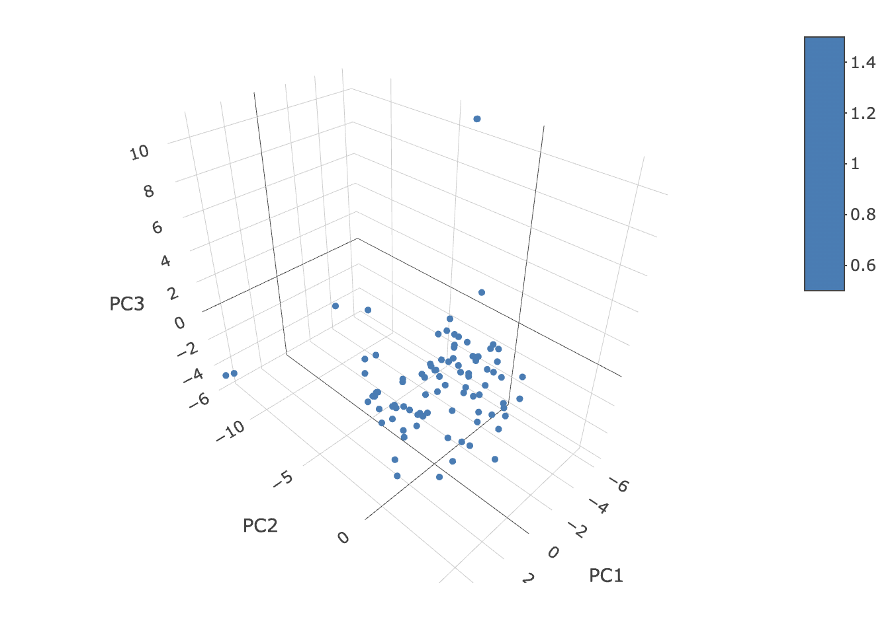
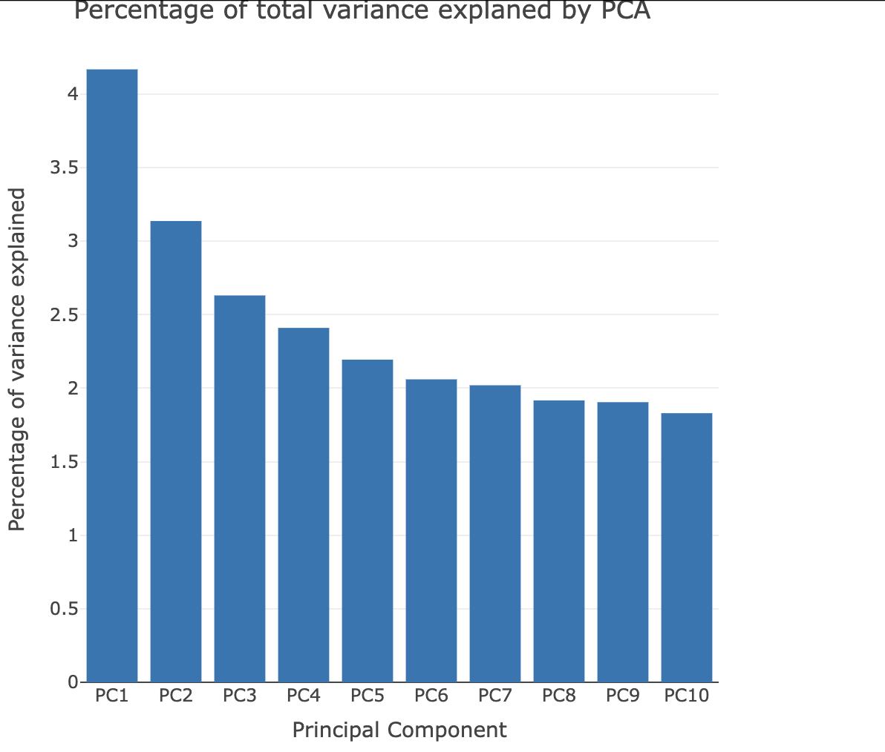
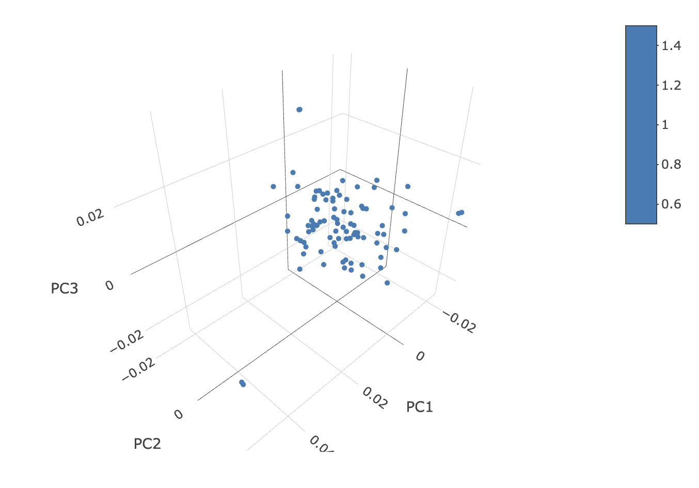

```{r, include = FALSE}
knitr::opts_chunk$set(
  collapse = TRUE,
  comment = "#>"
)
```
```{r, echo=FALSE, message=FALSE, warning=FALSE}
library(MIPanalyzer)
```

This tutorial covers:

- Principal Component Analysis (PCA) on within-sample allele frequencies
- Principal Coordinates Analsis (PCoA) on pairwise genetic distances

## Principal Component Analysis (PCA)

Before doing anything, we will need to load some additional packages:

```{r, echo=FALSE, message=FALSE, warning=FALSE}
library(here)
```

We will use a dataset of bi-allelic data already in the `mipanalyzer_biallelic` format and filtered down to the samples of interest (see previous tutorial). We can load this example data as follows:

```{r}
# load data from within this package
dat_path <- here("inst/extdata", "dat_biallelic.rds")
dat_biallelic <- readRDS(dat_path)
```

The within-sample allele frequency (WSAF) can be simply calculated as `count` divided by `coverage`. This is carried out by the `get_wsaf()` function. Note that this function automatically imputes missing values as the mean of all non-missing values at each locus. This results in a complete matrix of the WSAF, but we should keep in mind that some of this is imputed data.

```{r}
# calculate within-sample allele frequencies
wsaf <- get_wsaf(dat_biallelic, )
```

It can be useful to produce a simple matrix plot of WSAFs:

```{r, fig.width=6, fig.height=6}
plot_wsaf(wsaf)
```

We will carry out PCA using these values.

```{r}
# calculate PCA
pca <- pca_wsaf(wsaf)

# plot first 3 components
plot_pca(pca, num_components = 3)
```
{width=80%}

This is a static image of the plot you will see - you will be able to rotate and zoom it. We do not see any clear signal of clustering in this plot, which may indicate that allele frequencies are relatively homogeneous throughout these samples.

We may also want to know how much variance is explained by each component:

```{r}
# plot percentage variance explained
plot_pca_variance(pca)
```
{width=60%}

Only a small percentage of the variance is explained by each component, which again indicates that there is weak structure in the data.

Finally, we may be interested in which loci are contributing the most to this PCA variation. This can be obtained through the loading values of a PCA. We can plot these values as a function of genomic position using the `plot_pca_contribution()` function. Note, this first requires us to extract the CHROM of each locus in numerical format:

```{r, fig.width=7, fig.height=8}
# get CHROM in numeric format for each locus
chrom_numeric <- mapply(function(x) as.numeric(strsplit(x, "_")[[1]][2]), dat_biallelic$loci$CHROM)

# plot loading values
plot_pca_contribution(pca, component = 1, chrom = chrom_numeric, pos = dat_biallelic$loci$POS)
```

Interestingly, it appears that a large proportion of the variance in WSAFs between samples is being driven by a few loci on chromosome 10. This would be a good candidate area to eplore in terms of what could be driving this signal.

## Principal Coordinates Analysis (PCoA) from genetic distances

An alternative way of exploring this data is to use principal coordinates analysis (PCoA). Unlike PCA, this works with an input matrix of distances, allowing us to be flexible with how we calculate these distances. We will use a [genomic distance measure](https://doi.org/10.7554/eLife.08714) described by the MalariaGen community that allows for distances to be calculated even between mixed infections.

We start by calculating the matrix of distances:

```{r}
# get genomic distance
gdist <- get_genomic_distance(dat_biallelic, report_progress = FALSE)
```

The output is an upper triangle matrix of distances between all samples:

```{r}
gdist[1:5, 1:5]
```

We can use the function `pcoa_genomic_distance()` to perform PCoA, and the function `plot_pcoa()` to plot the result:

```{r}
# perform PCoA
pcoa <- pcoa_genomic_distance(gdist)

# scatterplot
plot_pcoa(pcoa, num_components = 3)
```
{width=80%}

As before, we find little evidence of clustering, although there are a few interesting outliers. This implies that most samples have roughly the same genetic distance to all others, and so there is no strong signal of clustering of allele frequencies.
